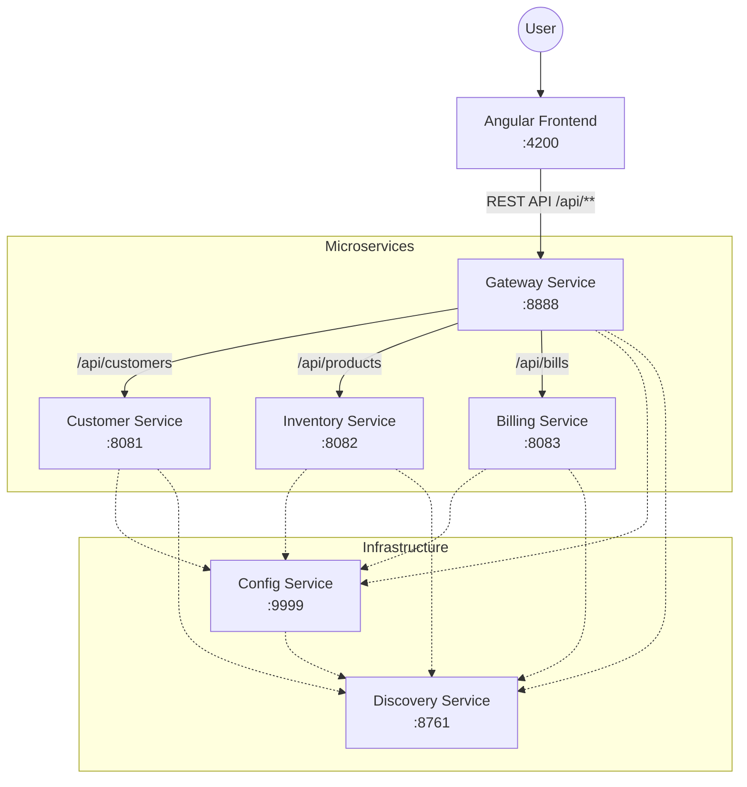

# Service Architecture & Access Guide

## Microservices Overview

| Microservice | Port | Description |
|---|---|---|
| **Discovery Service** | 8761 | Eureka Server for service registration and discovery. |
| **Config Service** | 9999 | Centralized configuration server. |
| **Gateway Service** | 8888 | API Gateway entry point. |
| **Customer Service** | 8081 | Customer management (Spring Data REST). |
| **Inventory Service** | 8082 | Product inventory (Spring Data REST). |
| **Billing Service** | 8083 | Billing and invoices (Rest Controller). |
| **Frontend App** | 4200 | Angular 19 Web Interface. |

## 🔗 Quick Access & Test Links

Use these links to verify the services are running and accessible.

### User Interface
- **Web Frontend**: [http://localhost:4200](http://localhost:4200)

### Infrastructure
- **Discovery Service Dashboard**: [http://localhost:8761](http://localhost:8761)
- **Config Service (Test)**: [http://localhost:9999/customer-service/default](http://localhost:9999/customer-service/default) (Check if config loads)
- **Gateway Actuator**: [http://localhost:8888/actuator/gateway/routes](http://localhost:8888/actuator/gateway/routes) (View configured routes)

### Data Services (via Gateway)
These are the primary endpoints for client access.

- **Customers (List)**: [http://localhost:8888/api/customers](http://localhost:8888/api/customers)
- **Products (List)**: [http://localhost:8888/api/products](http://localhost:8888/api/products)
- **Bill via ID (e.g., 1)**: [http://localhost:8888/api/bills/1](http://localhost:8888/api/bills/1) _(Requires Bill with ID 1 to exist)_
- **Bills by Customer (e.g., 1)**: [http://localhost:8888/api/bills/customer/1](http://localhost:8888/api/bills/customer/1)

### Data Services (Direct Access)
Useful for debugging individual services bypassing the gateway.

- **Customer Service**: [http://localhost:8081/api/customers](http://localhost:8081/api/customers)
- **Inventory Service**: [http://localhost:8082/api/products](http://localhost:8082/api/products)
- **Billing Service (Get Bill 1)**: [http://localhost:8083/api/bills/1](http://localhost:8083/api/bills/1)

## Gateway Configuration

The Gateway runs on port **8888** and routes traffic as follows:

| Path Pattern | Target Service | Content |
|---|---|---|
| `/api/customers/**` | `CUSTOMER-SERVICE` | StripPrefix=1 |
| `/api/products/**` | `INVENTORY-SERVICE` | StripPrefix=1 |
| `/api/bills/**` | `BILLING-SERVICE` | StripPrefix=1 |

## Architecture Diagram

